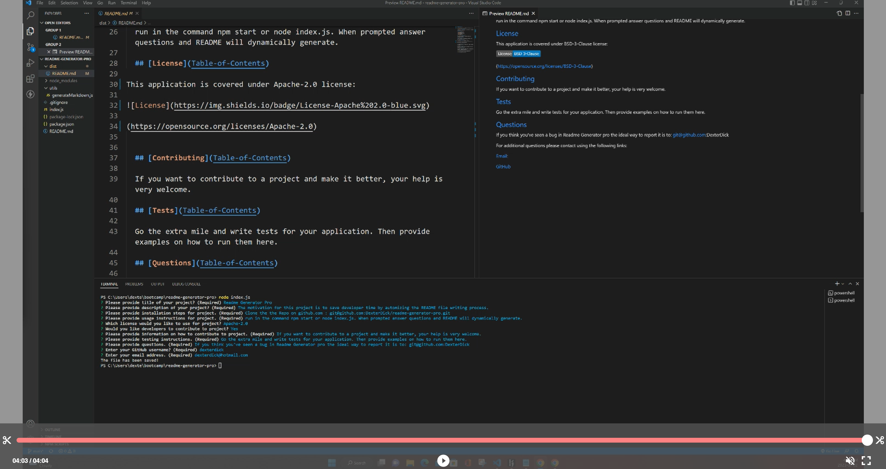

# README Generator Pro

## Description

The motivation for this project is to save developer time by automizing the README file writing process.

One advantge of this generator app is the user dose not have to learn how to use markdown syntax to generate a professional README file.

The App run in the command-line and dynamically generates a professional README.md file by asking a series of questions about the project using the Inquirer package and Node Js.

README Generator Pro allow developer to devote more time working on the project by automizing the README file writing process.

## Walkthrough video

